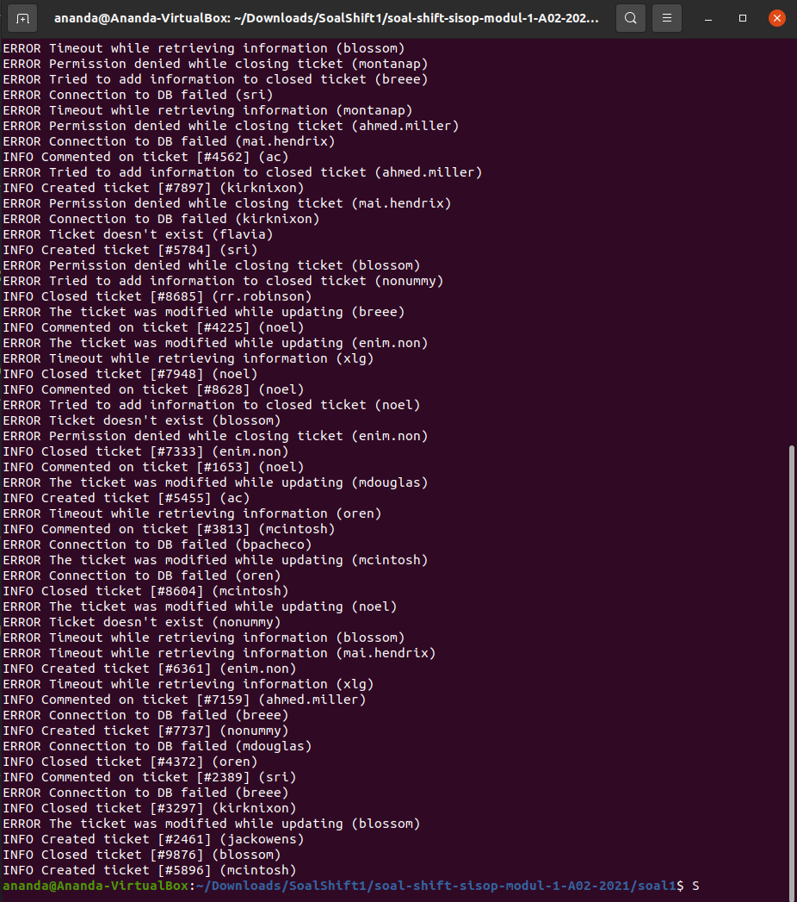
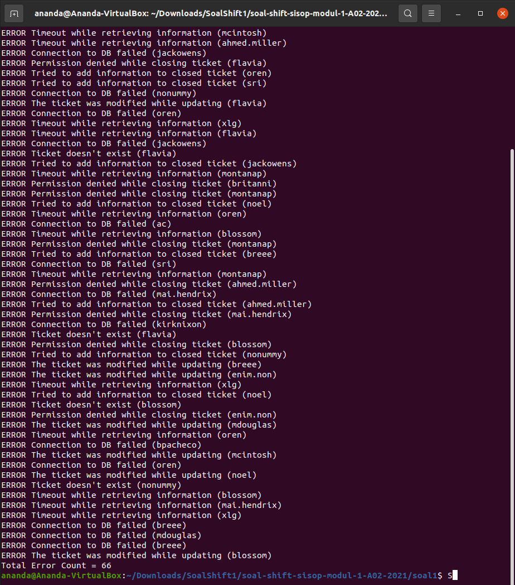
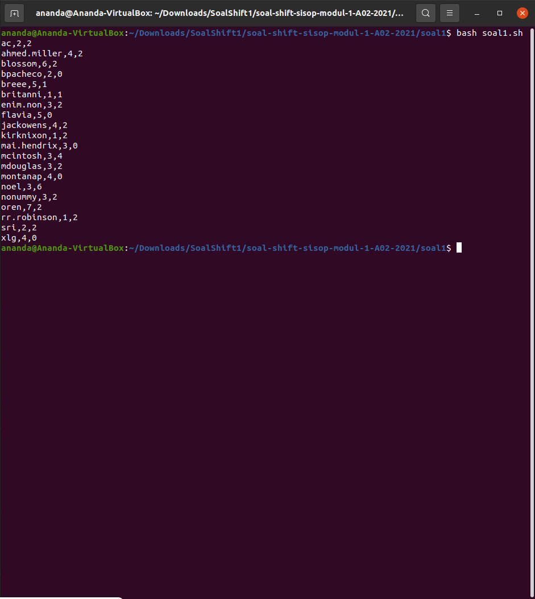
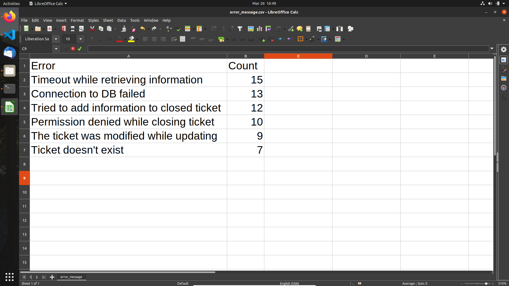
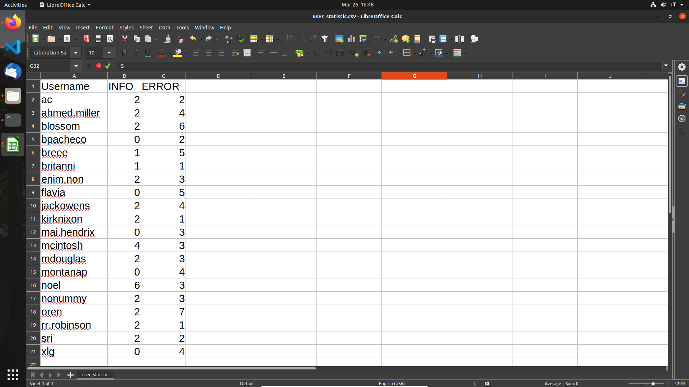

# Soal Shift Modul 1 Kelompok A02 2021

Nama Anggota Kelompok :
1. Bayu Eka Prawira         (05111940000042)
2. Putu Ananda Satria Adi   (05111940000113)
3. Izzulhaq Fawwaz Syauqiy  (05111840000023)

## Soal 1
### Narasi Soal
Ryujin baru saja diterima sebagai IT support di perusahaan Bukapedia. Dia diberikan tugas untuk membuat laporan harian untuk aplikasi internal perusahaan, *ticky*. Terdapat 2 laporan yang harus dia buat, yaitu laporan **daftar peringkat pesan error** terbanyak yang dibuat oleh *ticky* dan laporan **penggunaan user** pada aplikasi *ticky*. Untuk membuat laporan tersebut, Ryujin harus melakukan beberapa hal berikut:


### 1a
**Soal**  
Mengumpulkan informasi dari log aplikasi yang terdapat pada file `syslog.log`. Informasi yang diperlukan antara lain: jenis log (ERROR/INFO), pesan log, dan username pada setiap baris lognya. Karena Ryujin merasa kesulitan jika harus memeriksa satu per satu baris secara manual, dia menggunakan regex untuk mempermudah pekerjaannya. Bantulah Ryujin membuat regex tersebut.  
</br>

**Jawab**  
Pada soal ini diminta untuk menampilkan jenis log (ERROR/INFO), pesan log, dan username pada setiap baris log. Berikut adalah baris kode untuk dapat menampilkan log sesuai permintaan soal:
```sh
grep -oE '(INFO\s.*)|(ERROR\s.*)' syslog.log
```
</br>

**Penjelasan :**
- Command `grep` digunakan untuk mencari teks dengan regex yang sudah ditentukan.
  - Option `-o` berfungsi untuk hanya menampilkan teks sesuai dengan regex.
  - Option `-E` menginterpretasi argumen selanjutnya sebagai Extended Regular Expressions (EREs).
- Regex yang digunakan adalah `'(INFO\s.*)|(ERROR\s.*)'` untuk dapat mendapatkan hasil sesuai dengan permintaan soal.
  - Dalam regex ini terdapat operator | (OR) untuk memilih regex mana yang sesuai dengan baris tersebut. Untuk kasus ini ada `(INFO\s.*)` dan `(ERROR\s.*)`
  - Secara umum pola yang digunakan adalah `(<teks>.*)`, dimana \<teks\> merupakan teks yang dicari, dan `.*` digunakan untuk *match* semua huruf dibelakang pola teks.

Ketika command diatas dijalankan, berikut adalah output yang dihasilkan:  
  

### 1b
**Soal**  
Kemudian, Ryujin harus menampilkan semua pesan error yang muncul beserta jumlah kemunculannya.  
</br>

**Jawab**  
Pada soal ini saya sendiri (Ananda) sedikit bingung permintaan soal, apakah diminta jumlah ERROR yang muncul atau jumlah setiap pesan ERROR yang muncul. Karena saat pertama membaca soal yang muncul dibenak saya untuk menghitung jumlah ERROR yang muncul, maka implementasinya adalah sebagai berikut:
```sh
grep -oE 'ERROR.*' syslog.log
echo Total Error Count = $(grep -cE "ERROR" syslog.log)
```
</br>

**Penjelasan :**
- Baris pertama dari potongan kode diatas mirip dengan soal 1a, untuk menampilkan semua pesan ERROR dalam `syslog.log`
- Untuk baris kedua menampilkan jumlah ERROR yang muncul dalam `syslog.log`
  - Pada bagian kanan terdapat command `grep` dengan regex "ERROR"
  - Menggunakan option `-c` untuk menampilkan jumlah kata yang *match* dengan regex diatas
  
Ketika command diatas dijalankan, berikut adalah output yang dihasilkan:  
  

### 1c
**Soal**  
Ryujin juga harus dapat menampilkan jumlah kemunculan log ERROR dan INFO untuk setiap user-nya.  
</br>

**Jawab**  
Pada soal ini diminta untuk menampilkan jumlah kemunculan log ERROR dan INFO dari setiap user yang ada pada `syslog.log`. Implementasi dari kami adalah sebagai berikut:

```sh
usernames=$(grep -oE '(\(.*\))' syslog.log)
echo "$usernames" | tr -d ')' | tr -d '(' | sort | uniq |
    while read -r user
    do
        userError=0
        userInfo=0
        for msg in $(grep -wh "$user" syslog.log)
        do
            if [ "$msg" = "ERROR" ]
            then
                userError=$((userError+1))
            fi
            if [ "$msg" = "INFO" ]
            then
                userInfo=$((userInfo+1))
            fi
        done
        echo $user,$userError,$userInfo
    done
```
</br>

**Penjelasan :**
- Pada baris pertama hasil dari `grep -oE '(\(.*\))' syslog.log` dimasukkan kedalam variabel *`usernames`*.
  
    ```sh
    usernames=$(grep -oE '(\(.*\))' syslog.log)
    ```
- Variabel *`usernames`* di-*echo* kemudian di-*pipe* dalam beberapa command.
  ```sh
  echo "$usernames" | tr -d ')' | tr -d '(' | sort | uniq |
  ```
  - Command `tr -d ')'` dan `tr -d '('` berguna untuk menghapus kurung yang masih terdapat dalam variabel *`usernames`*
  - Kemudian dilakukan `sort` dan `uniq` untuk mendapatkan hasil yang sorted dan uniq untuk setiap user.
  - Digunakan `while read` loop untuk membaca setiap line dari command sebelumnya.
    ```sh
    while read -r user
    do
        ...
    done
    ```
  - Dilakukan `grep` dengan option `-wh` untuk mengambil baris yang sesuai dengan nama *`username`* yang sedang dicari.  
  
    ```sh
    grep -wh "$user" syslog.log
    ```
  - Dilanjutkan dengan `for` loop hasil dari `grep` diatas, lalu dicek apakah *`msg`* tersebut mengandung ERROR atau INFO. Jumlah kemunculan ERROR dan INFO dimasukkan kedalam variabel.
    ```sh
    for msg in $(grep -wh "$user" syslog.log)
    do
        if [ "$msg" = "ERROR" ]
        then
            userError=$((userError+1))
        fi
        if [ "$msg" = "INFO" ]
        then
            userInfo=$((userInfo+1))
        fi
    done
    ```
  - Terakhir, jika loop sudah selesai maka hasil akan di-*echo* dengan format `$user, $userError, $userInfo` sesuai dengan permintaan soal.
    ```sh
    echo $user,$userError,$userInfo
    ```

Ketika command diatas dijalankan, berikut adalah output yang dihasilkan:  
  

### 1d
**Soal**  
Semua informasi yang didapatkan pada poin **b** dituliskan ke dalam `file error_message.csv` dengan header **Error,Count** yang kemudian diikuti oleh daftar pesan error dan jumlah kemunculannya **diurutkan** berdasarkan jumlah kemunculan pesan error dari yang terbanyak.  
Contoh:
```
Error,Count
Permission denied,5
File not found,3
Failed to connect to DB,2
```  
</br>

**Jawab**  
Pada soal ini diminta hasil dari soal **b** dimasukkan ke dalam file `error_message.csv` dengan header **Error, Count** yang kemudian **diurutkan** berdasarkan kemunculan pesan error dari yang terbanyak. Berhubung implementasi kami dari soal **b** belum sesuai dengan permintaan pada soal **d** ini, berikut adalah implementasi kami untuk soal **d**:
```sh
echo "Error","Count" > error_message.csv
errMessages=$(grep -oE 'ERROR.*' syslog.log)
echo "$errMessages" | grep -oP "(?<=ERROR\s).*(?=\()" | sort | uniq |
    while read -r errMsg
    do
        number=$(grep -c "$errMsg" syslog.log)
        errMsg+=','$number
        echo "$errMsg"
    done | sort -rnk 2 -t',' >> error_message.csv
```
</br>

**Penjelasan :**
- Karena soal meminta output dimasukkan kedalam file `error_message.csv` dengan header **Error, Count** maka pada baris pertama diinisialisasi header tersebut kedalam file `error_message.csv` dengan mode *overwrite*.

    ```sh
    echo "Error","Count" > error_message.csv
    ```

- Pada baris selanjutnya hasil dari `grep -oE 'ERROR.*' syslog.log` dimasukkan kedalam variabel *`errMessages`*.
    ```sh
    errMessages=$(grep -oE 'ERROR.*' syslog.log)
    ```
- Variabel *`errMessages`* di-*echo* kemudian di-*pipe* kedalam beberapa command.
  ```sh
  echo "$errMessages" | grep -oP "(?<=ERROR\s).*(?=\()" | sort | uniq |
      while read -r errMsg
      do
          number=$(grep -c "$errMsg" syslog.log)
          errMsg+=','$number
          echo "$errMsg"
      done | sort -rnk 2 -t',' >> error_message.csv
  ```
  - Command pertama adalah `grep -oP "(?<=ERROR\s).*(?=\()"`, pada soal ini saya belajar bagaimana cara menggunakan *lookbehind* dan *lookahead* yang seharusnya bisa diimplementasikan pada soal c diatas untuk menghindari penggunaan `tr -d`.
  - Kemudian di-*pipe* dalam `sort` dan `uniq` untuk mendapatkan output yang *sorted* dan *unique*.
  - Kembali menggunakan `while read` loop untuk membaca setiap line dari hasil *pipe* dan dimasukkan ke variabel *`errMsg`*.
  - Menghitung kemunculan pesan ERROR terkait dengan menggunakan `grep -c "$errMsg" syslog.log` kemudian dimasukkan kedalam variabel *`number`*.
  - Hasil *`number`* di-*concatenate* dalam *`errMsg`* untuk kemudian di-*echo* lalu di-*pipe* dalam `sort -rnk 2 -t','`.
    - Option `-r` digunakan untuk *sort descending*.
    - Option `-n` digunakan untuk *numerical sort*.
    - Option `-k` digunakan untuk menspesifikasikan *key*.
    - Option `-t` digunakan untuk menspesifikasikan *separator* yang digunakan.

Ketika command diatas dijalankan, berikut adalah output yang dihasilkan:  
  

### 1e
**Soal**  
Semua informasi yang didapatkan pada poin **c** dituliskan ke dalam file `user_statistic.csv` dengan header **Username,INFO,ERROR diurutkan** berdasarkan username secara ***ascending***.  
Contoh:
```
Username,INFO,ERROR
kaori02,6,0
kousei01,2,2
ryujin.1203,1,3
```  
</br>

**Jawab**  
Pada soal ini diminta untuk memasukkan hasil dari poin **c** dituliskan ke dalam file `user_statistic.csv` dengan header **Username,INFO,HEADER diurutkan** berdasarkan username secara **ascending**.
```sh
echo Username,INFO,ERROR > user_statistic.csv
usernames=$(grep -oE '(\(.*\))' syslog.log)
echo "$usernames" | tr -d ')' | tr -d '(' | sort | uniq |
    while read -r user
    do
        userError=0
        userInfo=0
        for msg in $(grep -wh "$user" syslog.log)
        do
            if [ "$msg" = "ERROR" ]
            then
                userError=$((userError+1))
            fi
            if [ "$msg" = "INFO" ]
            then
                userInfo=$((userInfo+1))
            fi
        done
        echo $user,$userInfo,$userError >> user_statistic.csv
    done
```
</br>

**Penjelasan :**  
Untuk dapat menyelesaikan soal 1e ini hanya diperlukan beberapa tambahan kode.
- Pada bagian awal ditambahkan `echo Username,INFO,ERROR > user_statistic.csv` untuk *overwrite* file `user_statistic.csv`
- Pada bagian `echo $user,$userInfo,$userError` ditambahkan ` >> user_statistic.csv` untuk append hasil ke dalam `user_statistic.csv`.

Ketika command diatas dijalankan, berikut adalah output yang dihasilkan:  
  

## Soal 2
### Narasi Soal
Steven dan Manis mendirikan sebuah *startup* bernama “TokoShiSop”. Sedangkan kamu dan Clemong adalah karyawan pertama dari TokoShiSop. Setelah tiga tahun bekerja, Clemong diangkat menjadi manajer penjualan TokoShiSop, sedangkan kamu menjadi kepala gudang yang mengatur keluar masuknya barang.

Tiap tahunnya, TokoShiSop mengadakan Rapat Kerja yang membahas bagaimana hasil penjualan dan strategi kedepannya yang akan diterapkan. Kamu sudah sangat menyiapkan sangat matang untuk raker tahun ini. Tetapi tiba-tiba, Steven, Manis, dan Clemong meminta kamu untuk mencari beberapa kesimpulan dari data penjualan `Laporan-TokoShiSop.tsv`.

### 2a
**Soal**  
Steven ingin mengapresiasi kinerja karyawannya selama ini dengan mengetahui **Row ID** dan ***profit percentage* terbesar** (jika hasil profit *percentage* terbesar lebih dari 1, maka ambil Row ID yang paling besar). Karena kamu bingung, Clemong memberikan definisi dari *profit percentage*, yaitu:

`Profit Percentage = (Profit / Cost Price) * 100`

*Cost Price* didapatkan dari pengurangan *Sales* dengan *Profit*. (**Quantity diabaikan**).
</br>

**Jawab**

**Code :**
```awk
(NR > 1){
    profitPercentage = profit / (sales - profit) * 100;
    if(profitPercentage >= maxProfit)
    {
        maxId = rowId;
        maxProfit = profitPercentage;
    }
}
```
Di dalam soal, kita diminta untuk mengetahui Row ID dan profit percentage karyawan terbesar. Diketahui bahwa untuk mencari besar profit percentage tiap karyawan, yaitu:\
`Profit Percentage = (Profit / Cost Price) * 100%`\
Kemudian jika hasil profit percentage lebih dari 1, maka kita mengambil Row ID terbesar, sehingga didapatkan data sebagai berikut :
|   Row ID      | Profit Percentage |
| ------------- | ----------------- |
|       9952    | 100%              |


### 2b
**Soal**  
Clemong memiliki rencana promosi di Albuquerque menggunakan metode MLM. Oleh karena itu, Clemong membutuhkan daftar **nama *customer* pada transaksi tahun 2017 di Albuquerque**.
  
**Jawab**

**Code :**

```awk
(NR > 1){
    if(city == "Albuquerque" && substr($3,7) == "17")
    {
        datCus[cusName] = 1;
    }    
}
```

Di dalam soal, kita diminta untuk mencari daftar nama customer yang melakukan transaksi pada tahun 2017 dan di kota Albuquerque. \
Sehingga untuk mencari data tersebut, kita melakukan pencarian hingga EOF, dan disimpan ke dalam array yang masing-masing data diinisialisasi dengan 1 agar tidak ada data yang double. 

Kemudian maksud dari 
```awk
substr($3,7) == "17" 
```
adalah di dalam kolom $3 yang berisikan tanggal transaksi, kita menganggap bahwa isi dari tanggal transaksi tersebut adalah **string**, oleh karena itu, untuk mengambil tahunnya saja, kita perlu memecah **string** tersebut menjadi **substring** di mana tahun dimulai pada **substring** ke 7 hingga akhir.

Sehingga menghasilkan daftar nama customer sebagai berikut :

| Nama Customer |
| ------------- |
|Benjamin Farhat|
|Michelle Lonsdale |
|Susan Vittorini |
|David Wiener   |


### 2c
**Soal**  
TokoShiSop berfokus tiga *segment customer*, antara lain: *Home Office*, *Customer*, dan *Corporate*. Clemong ingin meningkatkan penjualan pada *segment customer* yang paling sedikit. Oleh karena itu, Clemong membutuhkan **segment *customer*** dan **jumlah transaksinya yang paling sedikit**.
  
**Jawab**  
Soal meminta kita untuk mencari *segment customer* yang memiliki peningkatan penjualan paling sedikit. \
Hal yang pertama dilakukan adalah dengan menginisialisasi variabel - variabel pendukung yang akan digunakan dalam operasi hitung di bawah.
```awk
BEGIN{
    cons = 0;
    hom = 0;
    corp = 0;
}
```
Kemudian, setelah menginisialisasi variabel - variabel yang dibutuhkan, kita tinggal mengecek data di dalam file `Laporan-TokoShiSop.tsv`hingga EOF yang memiliki segment *Consumer*, *Home Office*, atau *Corporate* dan meng-*increment* variabel di atas untuk menghitung jumlah segmen - segmen tersebut.
```awk
(NR > 1){
    if(segment == "Consumer")
    {
        cons++;
    }
    else if(segment == "Home Office")
    {
        hom++;
    }
    else if(segment == "Corporate")
    {
        corp++;
    }
}
```
Lalu pada bagian **END**, kita melakukan perbandingan antarsegment, misalkan, jika segment *consumer* lebih besar daripada *Home Office*, maka segment terkecil adalah *Home Office*, dan begitu seterusnya seperti **code** di bawah ini.
```awk
END{
    if(cons > hom)
    {
        minSeg = hom;
        segCusMin = "Home Office";
    }
    else if(hom > corp)
    {
        minSeg = corp;
        segCusMin = "Corporate";
    }
    else if(corp > cons)
    {
        minSeg = cons;
        segCusMin = "Consumer";
    }
}
```

Sehingga dihasilkan data sebagai berikut :
|  Jumlah Transaksi   | Segment |
| ------------- | ----------------- |
|       1783    | Home Office  |


### 2d
**Soal**  
TokoShiSop membagi wilayah bagian (*region*) penjualan menjadi empat bagian, antara lain: *Central*, *East*, *South*, dan *West*. Manis ingin mencari **wilayah bagian (*region*) yang memiliki total keuntungan (*profit*) paling sedikit** dan **total keuntungan wilayah tersebut**.
  
**Jawab**  
Soal meminta kita untuk mencari *region* yang memiliki total keuntungan (*profit*) paling sedikit dan besar total keuntungannya. \
Hal yang pertama dilakukan adalah dengan menginisialisasi variabel - variabel pendukung yang akan digunakan dalam operasi hitung di bawah.
```awk
BEGIN{
    profC = 0;
    profW = 0;
    profS = 0;
    profE = 0;
}
```
Kemudian, setelah menginisialisasi variabel - variabel yang dibutuhkan, kita tinggal mengecek data di dalam file `Laporan-TokoShiSop.tsv`hingga EOF yang memiliki region *Central*, *West*, *South*, atau *East* dan menjumlahkan variabel di atas dengan profit tiap region untuk menghitung jumlah profit masing - masing region tersebut.
```awk
(NR > 1){
    if(region == "Central")
    {
        profC += profit;
    }
    else if(region == "West")
    {
        profW += profit;
    }
    else if(region == "South")
    {
        profS += profit;
    }
    else if(region == "East")
    {
        profE += profit;
    }
}
```
Lalu pada bagian **END**, kita melakukan perbandingan antarregion, misalkan, jika region *Central* lebih kecil daripada *West*, maka region dengan profit terkecil adalah *Central*, dan begitu seterusnya seperti **code** di bawah ini.
```awk
END{
    if(profC < profW)
    {
        regMin = profC;
        regName = "Central";
    }

    else if(profW < profS)
    {
        regMin = profW;
        regName = "West";
    }

    else if(profS < profE)
    {
        regMin = profS;
        regName = "South";
    }

    else if(profE < profC)
    {
        regMin = profE;
        regName = "East";
    }
}
```

Sehingga dihasilkan data sebagai berikut :
|  Profit   | Region |
| ------------- | ----------------- |
|       39706.4    | Central  |


### 2e
**Soal** \
kamu diharapkan bisa membuat sebuah script yang akan menghasilkan file “hasil.txt” yang memiliki format sebagai berikut:

>Transaksi terakhir dengan profit percentage terbesar yaitu ***ID Transaksi*** dengan persentase ***Profit Percentage***%.</br></br>
>Daftar nama customer di Albuquerque pada tahun 2017 antara lain:
***Nama Customer1***
***Nama Customer2* dst**</br></br>
>Tipe segmen customer yang penjualannya paling sedikit adalah ***Tipe Segment*** dengan ***Total Transaksi*** transaksi.</br></br>
>Wilayah bagian (region) yang memiliki total keuntungan (profit) yang paling sedikit adalah ***Nama Region*** dengan total keuntungan ***Total Keuntungan (Profit)***

**Jawab**  
Pada soal, kita hanya diminta untuk menampilkan hasil - hasil dari perhitungan sebelumnya ke dalam beberapa kalimat yang hasilnya disimpan ke dalam file **hasil.txt**

```awk
awk -F '\t' '

...

END{
    printf "Transaksi terakhir dengan profit percentage terbesar yaitu " maxId " dengan persentase "maxProfit"%.\n\n";

    printf "Daftar nama customer di Albuquerque pada tahun 2017 antara lain:\n";
    for(i in datCus)
    {
        printf "%s\n",i;
    }

    printf "\nTipe segmen customer yang penjualannya paling sedikit adalah " segCusMin " dengan " minSeg " transaksi.\n\n";

    printf "Wilayah bagian (region) yang memiliki total keuntungan (profit) yang paling sedikit adalah " regName " dengan total keuntungan " regMin "\n";
}
' Laporan-TokoShiSop.tsv > hasil.txt
```
Sehingga menghasilkan

>Transaksi terakhir dengan profit percentage terbesar yaitu 9952 dengan persentase 100%.</br></br>
>Daftar nama customer di Albuquerque pada tahun 2017 antara lain:</br>
>Benjamin Farhat</br>
>Michelle Lonsdale</br>
>Susan Vittorini</br>
>David Wiener</br></br>
>Tipe segmen customer yang penjualannya paling sedikit adalah Home Office dengan 1783 transaksi.</br></br>
>Wilayah bagian (region) yang memiliki total keuntungan (profit) yang paling sedikit adalah Central dengan total keuntungan 39706.4


## Soal 3
### Narasi Soal
Kuuhaku adalah orang yang sangat suka mengoleksi foto-foto digital, namun Kuuhaku juga merupakan seorang yang pemalas sehingga ia tidak ingin repot-repot mencari foto, selain itu ia juga seorang pemalu, sehingga ia tidak ingin ada orang yang melihat koleksinya tersebut, sayangnya ia memiliki teman bernama Steven yang memiliki rasa kepo yang luar biasa. Kuuhaku pun memiliki ide agar Steven tidak bisa melihat koleksinya, serta untuk mempermudah hidupnya, yaitu dengan meminta bantuan kalian. Idenya adalah :

### 3a
**Soal**  
Membuat script untuk **mengunduh** 23 gambar dari `"https://loremflickr.com/320/240/kitten"` serta **menyimpan** log-nya ke file `"Foto.log"`. Karena gambar yang diunduh acak, ada kemungkinan gambar yang sama terunduh lebih dari sekali, oleh karena itu kalian harus **menghapus** gambar yang sama (tidak perlu mengunduh gambar lagi untuk menggantinya). Kemudian **menyimpan** gambar-gambar tersebut dengan nama "Koleksi_XX" dengan nomor yang berurutan **tanpa ada nomor yang hilang** (contoh : Koleksi_01, Koleksi_02, ...)
</br>

**Jawab**  
```sh
#!/bin/bash

if [[ ! -d ~/Downloads/soal-shift-sisop-modul-1-A02-2021 ]]
then
    mkdir ~/Downloads/soal-shift-sisop-modul-1-A02-2021
    if [[ ! -d ~/Downloads/soal-shift-sisop-modul-1-A02-2021/soal3res ]]
    then
        mkdir ~/Downloads/soal-shift-sisop-modul-1-A02-2021/soal3res
    fi
fi

cd ~/Downloads/soal-shift-sisop-modul-1-A02-2021/soal3res || exit

downloadImage() {
    if [[ $(grep -c "$web$loc" Foto.log) -gt 1 ]]
    then
        counter=$((counter-1))
    else
        wget -o - "$web$loc" | grep -oP "/cache.*" > webLog.log
    fi
}

counter=0
for ((i=1; i<=23; i=i+1))
do
    web="https://loremflickr.com"
    toDownload=$(curl -s -i https://loremflickr.com/320/240/kitten)
    loc=$(echo "$toDownload" | grep "location" | grep -oP "/cache.*" | tr -d $'\r')
    filename=$(echo "$toDownload" | grep "location" | grep -oP "/resized/\K.*" | tr -d $'\r')

    if [[ $i -eq 0 ]]
    then
        echo "$web$loc" > Foto.log
        downloadImage
    else
        echo "$web$loc" >> Foto.log
        downloadImage
    fi

    echo "$counter"
    if [[ $counter -lt 10 ]]
    then
        mv "$filename" "Koleksi_0$counter.JPG"
    else
        mv "$filename" "Koleksi_$counter.JPG"
    fi

    counter=$((counter+1))
done


```
</br>

**Penjelasan :**  
- Pertama kita mengecek apakah *directory* `~/Downloads/soal-shift-sisop-modul-1-A02-2021/soal3res`, jika tidak ada maka dibuat *directory* tersebut. Kemudian dilakukan `cd` ke dalam *directory* terkait.
    ```sh
    if [[ ! -d ~/Downloads/soal-shift-sisop-modul-1-A02-2021 ]]
    then
        mkdir ~/Downloads/soal-shift-sisop-modul-1-A02-2021
        if [[ ! -d ~/Downloads/soal-shift-sisop-modul-1-A02-2021/soal3res ]]
        then
            mkdir ~/Downloads/soal-shift-sisop-modul-1-A02-2021/soal3res
        fi
    fi

    cd ~/Downloads/soal-shift-sisop-modul-1-A02-2021/soal3res || exit
    ```
- Inisialisasi variabel *`counter`* untuk penamaan file dan penggunaan `for` loop untuk men-*download* foto.
    ```sh
    counter=0
    for ((i=1; i<=23; i=i+1))
    do
        ...
    done
    ```
- Kemudian menginisialisasi beberapa variabel yang akan diperlukan untuk melakukan *download* foto.
    ```sh
    web="https://loremflickr.com"
    toDownload=$(curl -s -i https://loremflickr.com/320/240/kitten)
    loc=$(echo "$toDownload" | grep "location" | grep -oP "/cache.*" | tr -d $'\r')
    filename=$(echo "$toDownload" | grep "location" | grep -oP "/resized/\K.*" | tr -d $'\r')
    ```
    - `web` menyimpan alamat utama web
    - `toDownload` menggunakan bantuan *library* `curl` untuk mengetahui ke laman mana kita akan di-*redirect*. Menggunakan *option* `-i` untuk mendapatkan **header** dari web yang diakses. Kemudian *option* `-s` untuk men-*suppress* error jika terdapat error.
    - `loc` menyimpan alamat *redirect* dengan menggunakan `grep -oP "/cache.*"` kemudian `tr -d $'\r'` dikarenakan `\r` menyebabkan error pada bagian *download*.
    - `filename` menyimpan nama file yang didapatkan dari *redirect* menggunakan `grep -oP "/resized/\K.*"` dengan menggunakan *lookbehind* `\K` kemudian `tr -d $'\r'` dikarenakan `\r` menyebabkan error pada bagian *download*.

- Cek jika loop berada pada loop awal maka gunakan mode *overwrite*, jika tidak maka *append* ke `Foto.log`. Kemudian jalankan fungsi *`downloadImage`*.
    ```sh
    if [[ $i -eq 0 ]]
    then
        echo "$web$loc" > Foto.log
        downloadImage
    else
        echo "$web$loc" >> Foto.log
        downloadImage
    fi
    ```
- Setelah file di-*download*, akan di-*rename*. Dilakukan juga pengecekan apakah file yang ter-*download* sudah lebih dari 10 atau belum.
    ```sh
    echo "$counter"
    if [[ $counter -lt 10 ]]
    then
        mv "$filename" "Koleksi_0$counter.JPG"
    else
        mv "$filename" "Koleksi_$counter.JPG"
    fi

    counter=$((counter+1))
    ```
- Fungsi *`downloadImage`*
    ```sh
    downloadImage() {
        if [[ $(grep -c "$web$loc" Foto.log) -gt 1 ]]
        then
            counter=$((counter-1))
        else
            wget -o - "$web$loc" | grep -oP "/cache.*" > webLog.log
        fi
    }
    ```
    - Melakukan cek apakah foto yang akan di-*download* sudah pernah di-*download* sebelumnya. Kemudian mengurangkan *`counter`* untuk mencegah penamaan yang salah.
    - Jika belum maka *download* file tersebut.  


Ketika command diatas dijalankan, berikut adalah output yang dihasilkan:
 

### 3b
**Soal**
Karena Kuuhaku malas untuk menjalankan script tersebut secara manual, ia juga meminta kalian untuk menjalankan script tersebut **sehari sekali pada jam 8 malam** untuk tanggal-tanggal tertentu setiap bulan, yaitu dari **tanggal 1 tujuh hari sekali** (1,8,...), serta dari **tanggal 2 empat hari sekali** (2,6,...). Supaya lebih rapi, gambar yang telah diunduh beserta **log-nya**, **dipindahkan ke folder** dengan nama **tanggal unduhnya** dengan **format** "DD-MM-YYYY" (contoh : "13-03-2023").


**Jawab**

**soal3b[dot]sh** \
Soal 3b ini sebenarnya hanya penyempurnaan dari soal 3a, penyempurnaannya ada pada beberapa baris kode di awal file yang melakukan pengaturan **folder** sehingga tertata dengan baik. \
**Code :** \
Membuat direktori jika direktori yang diinginkan tidak ditemukan.
```sh
if [[ ! -d ~/Downloads/soal-shift-sisop-modul-1-A02-2021 ]]
then
    mkdir ~/Downloads/soal-shift-sisop-modul-1-A02-2021
    if [[ ! -d ~/Downloads/soal-shift-sisop-modul-1-A02-2021/soal3res ]]
    then
        mkdir ~/Downloads/soal-shift-sisop-modul-1-A02-2021/soal3res
    fi
fi
```
Membuat direktori yang memuat informasi pada tanggal *current date* folder itu dibuat
```sh
if [[ ! -d ~/Downloads/soal-shift-sisop-modul-1-A02-2021/soal3res/$(date +"%d-%m-%Y") ]]
then
    mkdir ~/Downloads/soal-shift-sisop-modul-1-A02-2021/soal3res/$(date +"%d-%m-%Y")
fi
```
Berpindah ke direktori di atas untuk melanjutkan operasi seperti pada **soal3a[dot]sh**.
```sh
cd ~/Downloads/soal-shift-sisop-modul-1-A02-2021/soal3res/$(date +"%d-%m-%Y") || exit

...

```

**cron3b.tab** \
Di dalam soal, kita diminta untuk menjalankan script **soal3b[dot]sh** pada tanggal - tanggal tertentu dengan ketentuan **sehari sekali pada jam 8 malam**, **tanggal 1 tujuh hari sekali** (1,8,...), serta **tanggal 2 empat hari sekali** (2,6,...), sehingga dengan menggunakan crontab, dihasilkan sebagai berikut
```
0 20 1/7,2/4 * * ~/Downloads/soal-shift-sisop-modul-1-A02-2021/soal3b.sh
```
di mana \
"0" menandakan bahwa dia baru bekerja pada **menit ke-0**, \
"20" menandakan pada **jam 8 malam**, \
"1/7" menandakan **mulai tanggal 1 kemudian melompat hingga 7 hari ke depan** \
"2/4" menandakan **mulai tanggal 2 kemudian melompat hingga 4 hari ke depan** 

Hasil :

 

### 3c
**Soal**  
Agar kuuhaku tidak bosan dengan gambar anak kucing, ia juga memintamu untuk **mengunduh** gambar kelinci dari `"https://loremflickr.com/320/240/bunny"`. Kuuhaku memintamu **mengunduh** gambar kucing dan kelinci secara **bergantian** (yang pertama bebas. contoh : tanggal 30 kucing > tanggal 31 kelinci > tanggal 1 kucing > ... ). Untuk membedakan folder yang berisi gambar kucing dan gambar kelinci, **nama folder diberi awalan** "Kucing_" atau "Kelinci_" (contoh : "Kucing_13-03-2023")
</br>

**Jawab**  
```sh
downloadBunny() {
    counter=0
    for ((i=1; i<=23; i=i+1))
    do
        web="https://loremflickr.com"
        toDownload=$(curl -s -i https://loremflickr.com/320/240/bunny)
        loc=$(echo "$toDownload" | grep "location" | grep -oP "/cache.*" | tr -d $'\r')
        filename=$(echo "$toDownload" | grep "location" | grep -oP "/resized/\K.*" | tr -d $'\r')

        if [[ $i -eq 0 ]]
        then
            echo "$web$loc" > ./$folder/Foto.log
            downloadImage
        else
            echo "$web$loc" >> ./$folder/Foto.log
            downloadImage
        fi

        echo "$counter"
        if [[ $counter -lt 10 ]]
        then
            mv "./$folder/$filename" "./$folder/Koleksi_0$counter.JPG"
        else
            mv "./$folder/$filename" "./$folder/Koleksi_$counter.JPG"
        fi

        counter=$((counter+1))
    done    
}


currentDate=$(date +"%d-%m-%Y")
yesterDate=$(date -d "yesterday" +"%d-%m-%Y")

echo "$currentDate","$yesterDate"

if [[ $(ls -l | grep "$yesterDate" | grep -c "Kelinci") -eq 1 ]]
then
    if [[ ! -d "Kucing_$currentDate" ]]
    then
        mkdir "Kucing_$currentDate"
        folder="Kucing_$currentDate"
        downloadKitten
    fi
else
    if [[ ! -d "Kelinci_$currentDate" ]]
    then
        mkdir "Kelinci_$currentDate"
        folder="Kelinci_$currentDate"
        downloadBunny
    fi
fi
```
</br>

**Penjelasan :**  
Untuk implementasi soal **3c** hanya diperlukan beberapa modifikasi dari soal **3a**. Modifikasi yang saya lakukan antara lain:
- Menyimpan tanggal saat ini (*`currentDate`*) dan tanggal kemarin (*`yesterDate`*).
- Menambahkan fungsi *`downloadBunny`* untuk men-*download* foto kelinci dari web yang sudah ditentukan.
- Melakukan pengecekan apakah terdapat folder `Kelinci_<$yesterDate>`, jika belum ada maka jalankan fungsi *`downloadBunny`*. Selain itu jalankan fungsi *`downloadKitten`*.
- Terdapat juga beberapa perubahan dalam fungsi *`download`* untuk dapat menyesuaikan dengan perubahan *directory* yang terjadi.


Ketika command diatas dijalankan, berikut adalah output yang dihasilkan:
 

### 3d
**Soal**
Untuk mengamankan koleksi Foto dari Steven, Kuuhaku memintamu untuk membuat script yang akan **memindahkan seluruh folder ke zip** yang diberi nama “Koleksi.zip” dan **mengunci** zip tersebut dengan **password** berupa tanggal saat ini dengan format "MMDDYYYY" (contoh : “03032003”).


**Jawab**

**Code :**
```sh
#!/bin/bash

password=$(date +'%m%d%Y')
```
Proses inisiasi password yang merupakan tanggal zip tersebut dibuat
```sh
cd ~/Downloads/soal-shift-sisop-modul-1-A02-2021/soal3res || exit

for file in $(ls)
do
zip -r -P "$password" Koleksi.zip $file;
rm -rf $file
done

```

Pada persoalan ini, kita diminta untuk membuat zip dari semua isi di dalam folder **/soal3res** dan menghapus file di luar zip, yaitu dengan menggunakan perulangan **for** untuk menginisiasi semua isi di dalam folder ke dalam variabel *`$file` dengan menggunakan `$(ls)`* yang secara langsung menampilkan semua data.

Untuk proses meng-*zip*, kita memerlukan zip yang berpassword, sehingga menggunakan 
```sh
zip -r -P "$password" Koleksi.zip $file;
```
di mana -P merupakan sebuah *command* untuk menginisiasi password dalam sebuah zip. \
Kemudian untuk menghapus file - file di luar zip, kita menggunakan 
```sh
rm -rf $file
```

Hasil :


Di dalam zip :

 

Password validity :

 

### 3e
**Soal**
Karena kuuhaku hanya bertemu Steven pada saat kuliah saja, yaitu setiap hari kecuali sabtu dan minggu, dari jam 7 pagi sampai 6 sore, ia memintamu untuk membuat koleksinya **ter-zip** saat kuliah saja, selain dari waktu yang disebutkan, ia ingin koleksinya **ter-unzip** dan **tidak ada file zip** sama sekali.

**Jawab**

Di dalam soal, kita diminta untuk mengeset waktu untuk proses meng-zip dan meng-unzip di waktu - waktu tertentu, **setiap hari kecuali sabtu dan minggu, dari jam 7 pagi sampai 6 sore untuk proses pengezipan**, sedangkan untuk proses pengunzipan di luar waktu - waktu itu (**di atas jam 6 sore pada setiap hari selain sabtu dan minggu**) dengan menggunakan **crontab** sebagai berikut
```
# zip (Untuk directory script soal3d.sh harap diganti menyesuaikan dengan lokasi file)
0 7 * * 1-5 ~/Downloads/soal-shift-sisop-modul-1-A02-2021/soal3d.sh
```
Untuk proses zip, kita tinggal menjalankan soal3d[dot]sh pada \
"0" = **menit ke-0** \
"7" = **jam 7 pagi** \
"1-5" = **hari Senin sampai Jumat**
```
# unzip
0 18 * * 1-5 cd ~/Downloads/soal-shift-sisop-modul-1-A02-2021/soal3res || exit; password=$(date +'%m%d%Y'); unzip -P "$password" ./Koleksi.zip; rm -rf ./Koleksi.zip
```
Untuk proses unzip, kita harus membuat kode shell lagi di dalam crontab sebagai berikut \
"0" = **menit ke-0** \
"18" = **jam 6 sore** \
"1-5" = **hari Senin sampai Jumat** 

kemudian untuk shellnya 
```sh 
cd ~/Downloads/soal-shift-sisop-modul-1-A02-2021/soal3res || exit; password=$(date +'%m%d%Y'); unzip -P "$password" ./Koleksi.zip; rm -rf ./Koleksi.zip
```
Prosesnya yaitu, 
1. Menginisiasi password tanggal hari itu, dikarenakan waktu untuk mengzip dan mengunzip berada pada tanggal yang sama
```sh
password=$(date +'%m%d%Y');
```
2. Mengunzip file dan menghapus file .zip
```sh
unzip -P "$password" ./Koleksi.zip; rm -rf ./Koleksi.zip
```

Hasil :

Zipping :

 

Unzipping :

 


# KENDALA
Untuk kendala yang kami alami cukup minim, hanya diperlukan searching yang banyak untuk dapat menyelesaikan masalah yang kami temui. Namun masalah yang paling terasa namun dapat kami atasi adalah tidak konsistennya directory file, sehingga pada soal no 3 kami harus membuat folder baru agar masalah tersebut dapat diatasi.

Selain itu, terdapat kendala di luar pengerjaan soal shift, yaitu salah satu anggota kelompok kami yang sama sekali tidak membantu. Kami berdua (Bayu dan Ananda) sudah sangat berupaya untuk menghubungi salah satu anggota kami tersebut, tetapi sama sekali tidak ada respon. Meskipun direspon, salah satu anggota kami hanya memberikan akun github dan whatsapp saja. Begitu pula ketika pembagian tugas tidak ada respon yang diberikan.